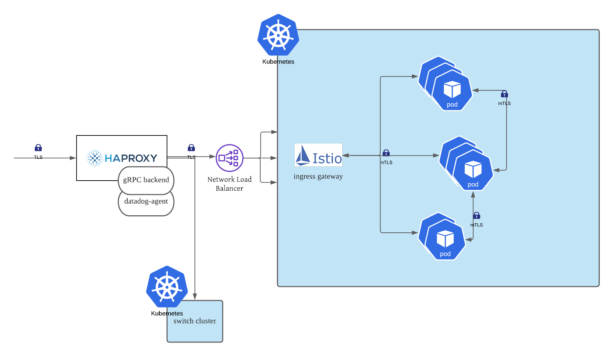
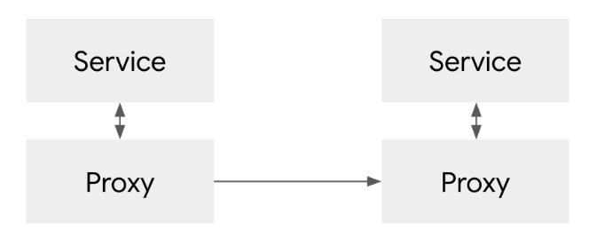

# gRPC

## 당근마켓 gRPC 인프라 구성

</img>

- 트래픽으로 인해 클러스터 변경될 수 있으므로 앞단에 프록시 레이어`HAPROXY` 사용

- 내부

  - *`Istio`를 Ingress gateway로 사용해 pod들이 gRPC를 통해 *서비스 메쉬로 통신할 수 있게함
  - 서비스 메시 실패시 `HAPROXY`로 돌아가 gRPC 백엔드로 내부 서비스로 다시 접근

- 스위칭 전략을 사용하고 이중화(Active-Active/Active-Standby) 전략은 사용X

  -  쿠버네티스는 멀티 [age](https://developer.mozilla.org/ko/docs/Web/HTTP/Headers/Age)(age 헤더는 객체가 프록시 캐시 내에 머무는 초단위의 시간을 가짐)를 갖기 때문에 스위칭하는 전략을 택함

    - 정확히 이해 못함😥

    

- [Istio](https://techcafe.tistory.com/133): 서비스 매쉬 구조를 구현한 오픈소스

- [서비스 매쉬란?](https://bcho.tistory.com/1293)

  
</img>

  - 내부에서 A서비스가 B서비스를 호출할 때 직접 호출하는게 아니라 프록시를 통해 호출
  - 서비스로 들어오거나 나가는 트래픽을 네트워크 단에서 모두 통제 가능